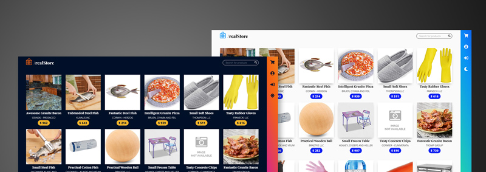

# React eCommerce

## Summary

// TODO:
What the project does?

### Requirements

Base on this generic backend:

- [Backend API](https://ecomerce-master.herokuapp.com/docs)

**Build an e-commerce with React.**

General functionality:

- [ ] Signup: Let users register
- [x] Login: Let users access
- [x] Show products
- [x] Show product details
- [ ] @login, distinguish between ADMIN users & CUSTOMER users

CUSTOMER functionality:

- [x] Guest view / User (no session / logged in)
- [x] See all products on the homepage
- [x] Search bar for products
- [x] If click on a product, see details in a unique route for this product

Guest:

- [x] Navbar on the right suggest signup / login
- [x] Signup & login views, each in its own route (/signup - /login)
- [x] Hay un botón comprar en la vista individual del detalle de cada producto, pero este está desactivado y debes mostrar (como desees) una invitación a registrarte o iniciar sesión.

Con Usuario:

- [x] En la navbar se muestra el nombre de usuario
- [x] Dentro del detalle individual de un producto, se muestra el botón "comprar"

Funcionalidades ADMIN:

- [ ] Debe tener todas las funcionalidades del CUSTOMER
- [ ] Puede dar de alta nuevos productos
- [ ] Implementar el carrito de compras en esta fase es opcional. Más adelante aprenderemos a trabajar con la Context API para esto ;)

## Motivation

Practice how to make a semi-real project from the ground up with React. (Maybe something you can encounter in the wild out there).

## Built With

- ReactJS
- React Router
- React Hooks
- Context API
- ...

## Features

1. Responsive Design.
1. Light/Dark Theme
1. Product Pagination
1. Search Bar
1. Skeleton loader

## Coming Soon

- Filter Sidebar
- Animations
